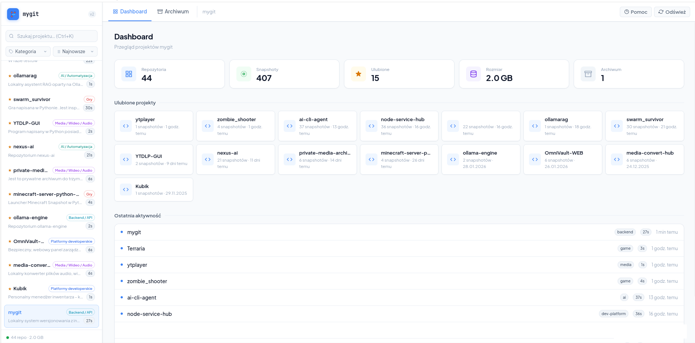
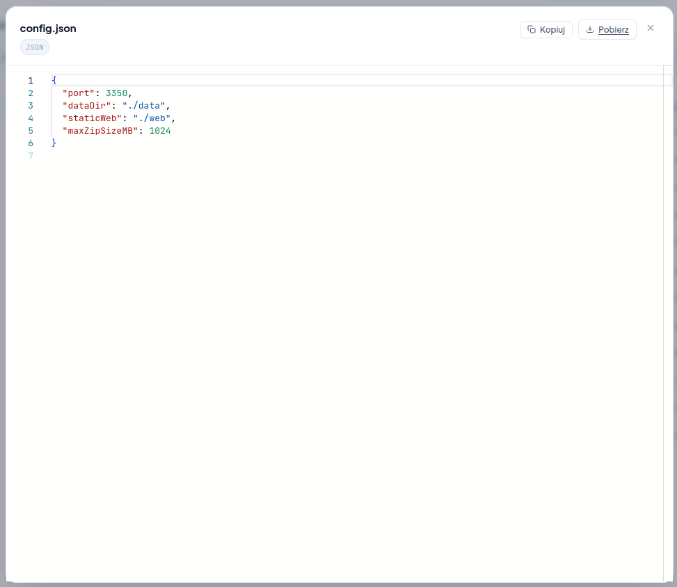
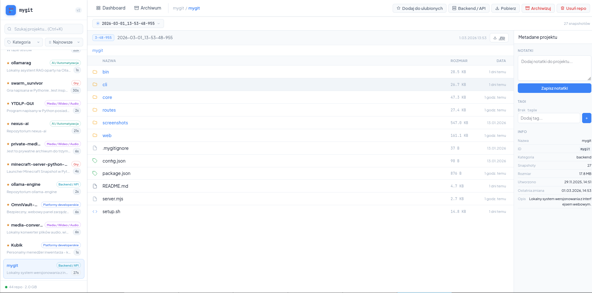
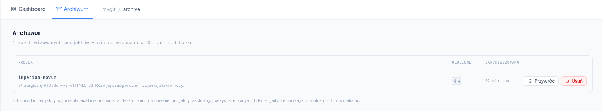
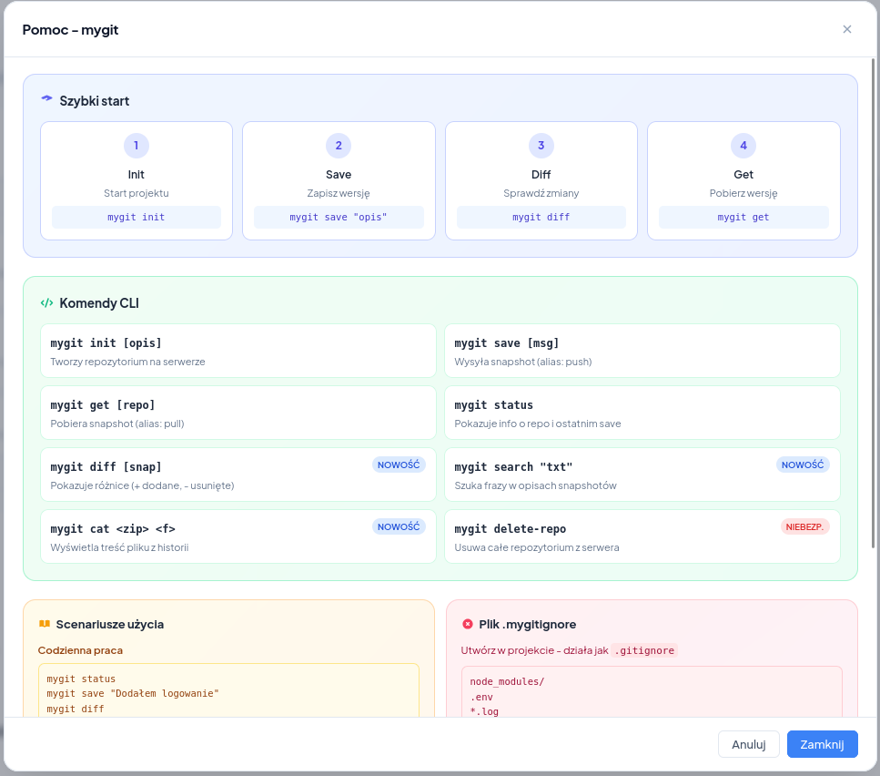
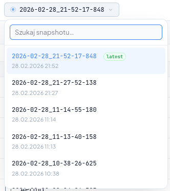

# mygit - lokalny system wersjonowania snapshotów

<p align="center">
  
</p>

mygit to lekki, szybki i niezależny system snapshotów dla projektów, który nie wymaga korzystania z Git, GitHub ani zewnętrznych repozytoriów. Narzędzie pozwala tworzyć lokalne punkty przywracania (snapshoty), przeglądać historię, porównywać zmiany, pobierać wersje plików i zarządzać repozytoriami przez interfejs webowy oraz CLI.

---

<details>
<summary><b>📸 Zrzuty ekranu</b> (kliknij aby rozwinąć)</summary>
<br>

<p align="center">
  <br><br>
  <br><br>
  <br><br>
  <br><br>
  
</p>

</details>

---

## ✨ Najważniejsze cechy
- **Snapshoty projektów w jednym poleceniu** - szybkie tworzenie backupów całych projektów
- **Historia zmian** - przeglądaj wszystkie snapshoty z pełnym opisem
- **Porównanie wersji** - diff między snapshotami z podziałem na dodane/usunięte/zmodyfikowane pliki
- **Przeglądanie snapshotów** - interfejs do przeglądania zawartości archiwum ZIP jak w menedżerze plików
- **Podgląd plików z kolorową składnią** - ponad 50 języków programowania, pliki `.env`, `.gitignore`, `.sh`, `.mjs` itp.
- **Ulubione repozytoria** - oznacz ważne projekty gwiazdkami dla szybkiego dostępu
- **Zaawansowane sortowanie** - sortuj według nazwy, daty, rozmiaru, tylko ulubione lub puste
- **Statystyki** - monitoruj zużycie przestrzeni dyskowej
- **Plik .mygitignore** - wykluczaj niepotrzebne pliki (jak node_modules) automatycznie
- **Działa w sieci lokalnej i zdalnie** - Synology, Linux, Docker
- **Lekki i szybki** - zero zależności, minimalna konfiguracja

---

## 🚀 Nowe funkcje (v1.0.0+)
- ⭐ **Ulubione repozytoria** - kliknij gwiazdkę aby oznaczyć ważne projekty
- 📊 **8 trybów sortowania** - sortuj według: ulubione, najnowsze, najstarsze, A-Z, Z-A, rozmiar ▲▼, tylko puste
- 🎨 **Kolorowa składnia** - podgląd plików z highlight.js dla 50+ języków
- 📋 **Kopiowanie do schowka** - szybkie kopiowanie kodu z podglądu plików
- 🎯 **Przewijanie tylko kodu** - lepsza ergonomia podglądu plików
- 🆕 **Rozbudowana pomoc** - kompleksowy przewodnik w formie kafelków
- 🔧 **Poprawki UI/UX** - animacje, gradienty, lepsze responsywność

---

# 📦 Instalacja

## Wymagania
- **Linux lub DSM (Synology)**
- **Node.js 18+** (zalecane najnowsza wersja LTS)
- **Bash** (dla skryptów instalacyjnych)

## 1. Pobierz projekt
```
git clone https://github.com/USER/mygit
cd mygit
```

## 2. Nadaj uprawnienia instalatorowi
```
chmod +x ./_install_linux.sh
```

## 3. Instalacja systemowa
```
sudo ./_install_linux.sh
```

Binarki zostaną zainstalowane w:
```
/usr/local/bin/
```

Po instalacji dostępne komendy:
- `mygit`
- `mygit-local`

---

# 🧪 Szybki start (CLI)

## Utwórz repozytorium
```
mygit init
```

## Dodaj snapshot
```
mygit save "Opis zmian"
```

## Historia snapshotów
```
mygit log
```

---

# 🌐 Uruchomienie Web UI
```
node server.mjs
```

Domyślny adres:
```
http://localhost:5050
```

---

# 📁 Struktura projektu
```
mygit/
├── bin/                    # Pliki wykonywalne (CLI)
│   ├── mygit              # Wrapper SSH dla Synology
│   └── mygit-local        # Lokalna wersja CLI
├── cli/                   # Kod źródłowy CLI (Commander.js)
│   └── index.js
├── core/                  # Główna logika aplikacji
│   ├── snapshot.js        # Tworzenie snapshotów (zip)
│   ├── repoManager.js     # Zarządzanie repozytoriami
│   ├── utils.js           # Narzędzia pomocnicze
│   └── paths.js           # Ścieżki systemowe
├── web/                   # Interfejs webowy (SPA)
│   └── index.html         # Główny plik z całym UI
├── data/                  # Dane aplikacji (tworzone automatycznie)
│   ├── repos/             # Repozytoria i snapshoty
│   └── favourites.json    # Ulubione repozytoria
├── screenshots/           # Zrzuty ekranu do README
├── _install_linux.sh      # Skrypt instalacyjny
├── _uninstall_linux.sh    # Skrypt dezinstalacyjny
├── server.mjs             # Serwer Express.js
├── config.json            # Konfiguracja (port, ścieżki)
└── package.json           # Zależności i skrypty npm
```

---

# 🧹 Odinstalowanie
```
sudo rm /usr/local/bin/mygit
sudo rm /usr/local/bin/mygit-local
# lub
sudo ./_uninstall_linux.sh
```

---

# 📄 Licencja
GNU Affero General Public License v3.0
